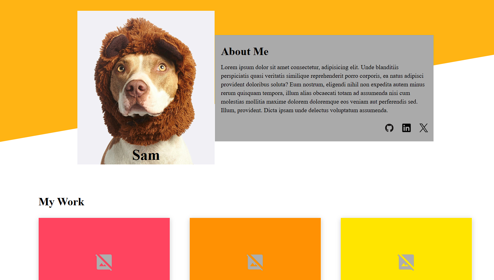

# Homepage

A simplistic homepage displaying placeholder information

Built as part of [The Odin Project](https://www.theodinproject.com/) curriculum to practice **website design** and **media queries**.

## Features

- Aesthetic looking design for a basic homepage
- Media queries for mobile devices and zooming in/out on a browser

## Demo

### [Live Demo](https://songzhang015.github.io/project-14-homepage/)

## Built Using

- HTML
- CSS
